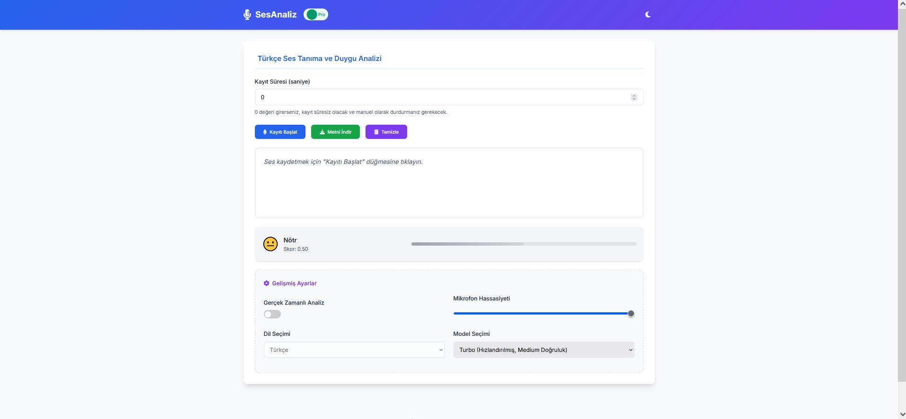

# 🎙️ Real-Time Voice and Emotion Processing

Welcome to the **Real-Time Voice and Emotion Processing** project — a real-time AI system that listens to your voice, transcribes it, and detects your emotions live. Designed using **Whisper** by OpenAI and a custom emotion recognition model, this project enables more human-like interaction for voice-driven applications.

---

## 📹 Demo

Watch the system in action!  
➡️ Click the link below to play the demo video (requires download):

[▶️ Watch Demo Video](video.mp4)

---

## 🖼️ Screenshot

Here is an example of the emotion analysis result:



---

## 🚀 Features

- 🎧 Real-time microphone audio capture
- 🔤 Instant transcription using OpenAI Whisper
- 😊 Emotion classification (Happy, Sad, Angry, Neutral, etc.)
- 🌐 Flask-powered web interface
- 📁 Result exporting as JSON
- 📊 Optional graph-based feedback
- 🧩 Lightweight and modular design

---

## 📚 Technologies Used

| Purpose              | Technology                      |
|----------------------|----------------------------------|
| Speech Recognition   | Whisper (PyTorch)                |
| Emotion Detection    | Scikit-learn or TensorFlow       |
| Backend              | Flask (Python 3.11)              |
| Audio Handling       | ffmpeg + pydub                   |
| UI                   | HTML, CSS, JavaScript            |

---

## ⚙️ Installation

Make sure you have Python 3.11+ and ffmpeg installed.

```bash
# Clone the repository
git clone https://github.com/yourusername/real-time-voice-emotion.git
cd real-time-voice-emotion

# Install dependencies
pip install -r requirements.txt

# Run the application
python app.py

Then open your browser and go to:
📍 http://127.0.0.1:5000
