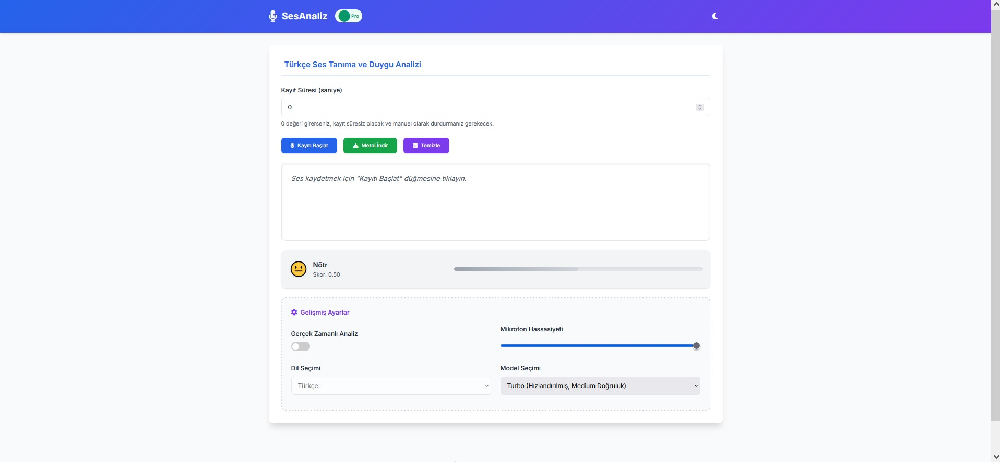

# Real-Time Voice & Emotion Processing


> Real-time speech-to-text transcription combined with emotion recognition from audio — processes live microphone input to simultaneously transcribe speech and detect the speaker's emotional state.

---

## Overview

This project fuses two AI pipelines into one real-time system:

1. **Speech Transcription** — OpenAI Whisper converts live audio to text with high accuracy across accents and noise conditions.
2. **Emotion Recognition** — A deep learning classifier analyzes acoustic features (pitch, energy, MFCCs) to predict the speaker's emotional state at inference time.

Both pipelines run concurrently on the same audio stream and results are served through a Flask web interface with live updates.

## Demo



[Watch the demo video](video.mp4)

## Features

- Real-time microphone audio capture
- Speech transcription powered by OpenAI Whisper (PyTorch)
- Multi-class emotion recognition — Happy, Sad, Angry, Neutral, and more
- Flask-powered web interface with live transcript and emotion feed
- Result export as JSON for downstream use
- Lightweight and modular architecture — swap models without rewriting the pipeline

## Tech Stack

| Category | Tools |
|----------|-------|
| Speech Recognition | OpenAI Whisper (PyTorch) |
| Emotion Classification | Scikit-learn / TensorFlow |
| Audio Handling | pydub, FFmpeg |
| Backend | Flask (Python 3.11) |
| Frontend | HTML5, CSS3, JavaScript |

## Project Structure

```
Real-Time-Voice-and-Emotion-Processing/
├── app.py              # Core backend — audio capture, Whisper, emotion inference, Flask server
├── index.html          # Browser-based live monitoring UI
├── requirements.txt    # Python dependencies
├── emotion_result.jpg  # Sample emotion recognition output
├── video.mp4           # Demo recording
└── LICENSE
```

## Getting Started

### Prerequisites

- Python 3.11+
- FFmpeg installed and on PATH (required by Whisper/pydub)
- A working microphone

### Installation

```bash
git clone https://github.com/ErdoganPeker/Real-Time-Voice-and-Emotion-Processing.git
cd Real-Time-Voice-and-Emotion-Processing
pip install -r requirements.txt
```

### Run

```bash
python app.py
```

Open your browser and go to `http://127.0.0.1:5000` to see the live transcript and emotion stream.

## How It Works

```
Microphone Input
      │
      ▼
 Audio Buffer (chunked)
      │
      ├──► Whisper Model ──────────────► Transcript Text
      │
      └──► Feature Extraction (MFCC, pitch, energy)
                │
                ▼
         Emotion Classifier ──► Emotion Label + Confidence
                │
                ▼
         Flask WebSocket / UI Output
```

## Author

**Erdogan Yasin Peker** — Computer Engineer | AI & ML Specialist

[GitHub](https://github.com/ErdoganPeker) · [LinkedIn](https://www.linkedin.com/in/erdogan-yasin-peker-b107ba24b/) · [Kaggle](https://www.kaggle.com/erdoanpeker)
