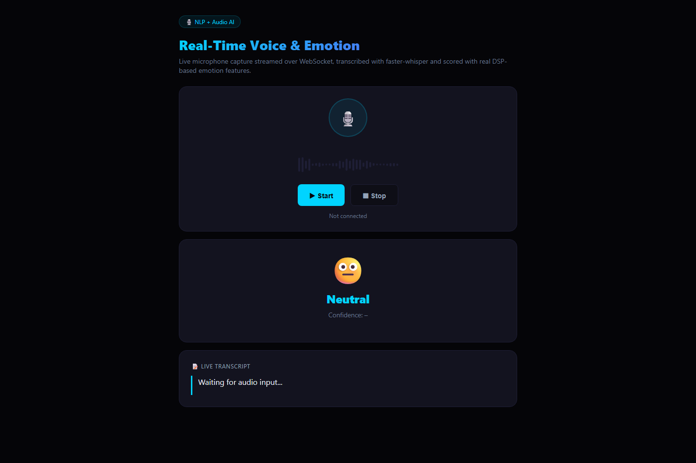

# Real-Time Voice & Emotion Processing


> Streams live microphone audio over a WebSocket and returns a continuously updating transcript alongside a real, signal-derived emotion reading — no cloud API, no canned output.



## Overview

This project pairs two genuinely computed pipelines on the same live audio stream:

1. **Speech-to-text** — [faster-whisper](https://github.com/SYSTRAN/faster-whisper) (the CTranslate2 port of OpenAI Whisper) transcribes audio on CPU with int8 quantization, using the `base` model.
2. **Emotion analysis** — a DSP-based scoring system built on [librosa](https://librosa.org/) extracts RMS energy, pitch/F0 (via the YIN algorithm), zero-crossing rate, and spectral centroid from each chunk, then maps those acoustic features through a reasoned weighting scheme into an emotion label and a full confidence breakdown. There is no randomness and no fixed/canned output — every number changes with the actual sound of your voice.

Both results are pushed back to the browser over the same WebSocket connection as you speak, so the UI updates continuously with no page reloads or polling.

## Features

- **Real-time speech-to-text** via faster-whisper (CTranslate2, CPU, int8 quantization) — low-latency transcription without a GPU
- **Real DSP-based emotion detection** — Happy, Sad, Excited, Calm, Stressed, and Neutral are derived from actual acoustic features (RMS energy, YIN pitch, zero-crossing rate, spectral centroid), not randomized or hardcoded
- **Confidence score and full emotion distribution** — every response includes the leading label plus a percentage breakdown across all emotion classes
- **Rolling-buffer transcription architecture** — the server accumulates audio in a per-connection buffer and re-transcribes the whole buffer on each chunk, committing text only at natural pauses (or a hard time cap), so words are never split across chunk boundaries
- **Live waveform visualization** — an animated audio waveform and a pulsing microphone icon reflect the input in real time
- **Emotion bar charts** — the live percentage breakdown for each emotion is rendered as animated bars in the browser

## How It Works

```
Browser microphone (Web Audio API)
        │  PCM16 audio chunks
        ▼
   WebSocket  (/ws/audio)
        │
        ▼
 Server-side rolling buffer  (accumulates audio since the last commit)
        │
        ├──► faster-whisper  ──────────────► transcript segments
        │
        └──► librosa DSP features  ─────────► RMS, F0/pitch, ZCR, spectral centroid
                     │
                     ▼
           weighted scoring + softmax ──► emotion label, confidence, full distribution
        │
        ▼
 Natural-pause detection ──► commit transcript & reset buffer (or trim on a max-length cap)
        │
        ▼
 Result pushed back over the same WebSocket ──► live transcript + emotion UI
```

On every incoming audio chunk, the server re-transcribes the entire rolling buffer rather than just the new bytes. This is what prevents words from being split across chunk boundaries. A commit happens — locking in the transcript so far and resetting the buffer — either when a trailing silence gap is detected (a natural pause) or when the buffer exceeds a maximum duration (a forced cut), which keeps memory and latency bounded for continuous speakers.

## Tech Stack

| Category | Tools |
|----------|-------|
| Backend | Python, FastAPI, WebSocket, Uvicorn |
| Speech Recognition | faster-whisper (CTranslate2, CPU, int8) |
| Emotion Analysis | librosa (RMS energy, YIN pitch/F0, zero-crossing rate, spectral centroid) |
| Numerical Processing | NumPy |
| Frontend | HTML5, CSS3, JavaScript, Web Audio API |
| Templating | Jinja2 |

## Getting Started

### Prerequisites

- Python 3.11+
- A working microphone
- A browser that supports the Web Audio API and grants microphone permissions (Chrome, Edge, Firefox)

### Installation

```bash
git clone https://github.com/ErdoganPeker/Real-Time-Voice-and-Emotion-Processing.git
cd Real-Time-Voice-and-Emotion-Processing/app
python -m venv .venv
.venv\Scripts\activate      # Windows
# source .venv/bin/activate # macOS/Linux
pip install -r requirements.txt
```

### Run

```bash
python main.py
```

Open `http://127.0.0.1:5015` in your browser and grant microphone access when prompted — the transcript and emotion readout update live as you speak.

> **Note**: The first run downloads the `faster-whisper` `base` model. You can override the model size with the `WHISPER_MODEL_SIZE` environment variable.

### Run with Docker

```bash
docker build -t voice-emotion .
docker run -p 8000:8000 voice-emotion
```

Then open `http://127.0.0.1:8000`.

## Project Structure

```
Real-Time-Voice-and-Emotion-Processing/
├── app/
│   ├── main.py           # FastAPI backend — WebSocket, rolling buffer, Whisper + DSP pipeline
│   ├── requirements.txt  # Python dependencies
│   └── templates/
│       └── index.html    # Live transcript + emotion UI (waveform, mic pulse, bar charts)
├── Dockerfile
├── screenshot.png
└── LICENSE
```

## Author

**Erdogan Yasin Peker** — Computer Engineer | AI & ML Specialist

[GitHub](https://github.com/ErdoganPeker) · [LinkedIn](https://www.linkedin.com/in/erdogan-yasin-peker-b107ba24b/) · [Kaggle](https://www.kaggle.com/erdoanpeker)

## License

MIT — see [LICENSE](LICENSE).
